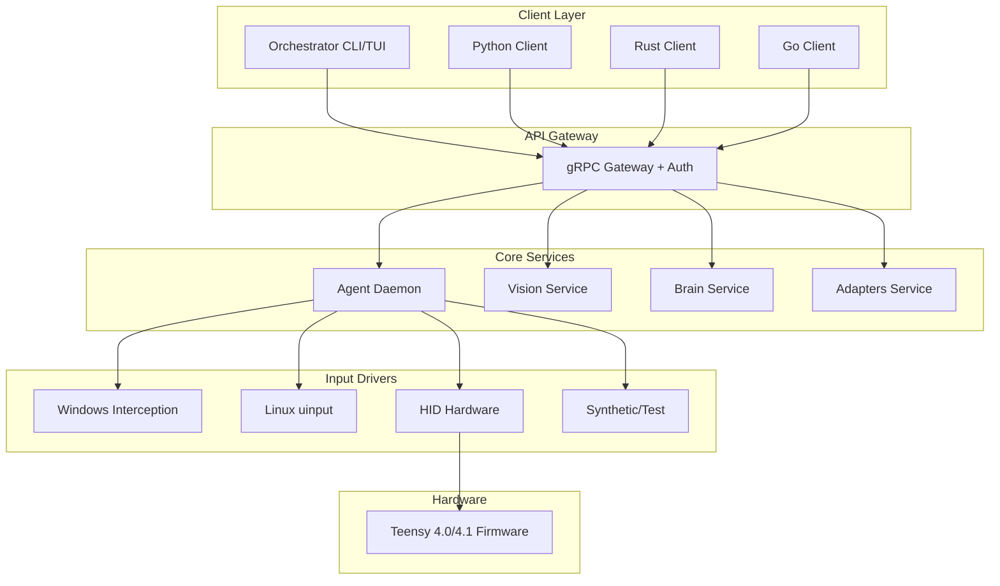
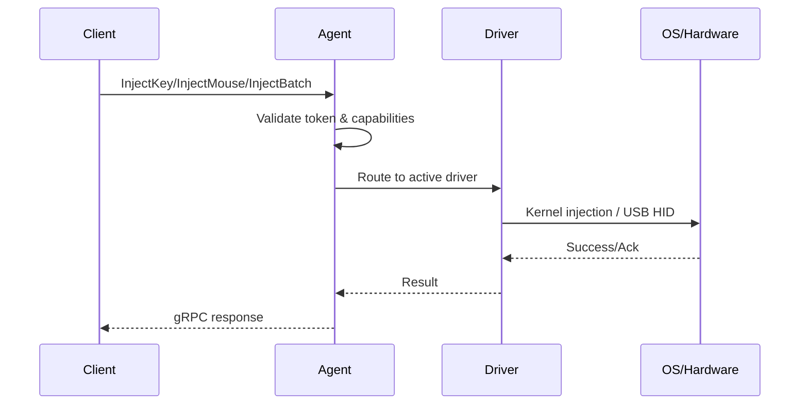
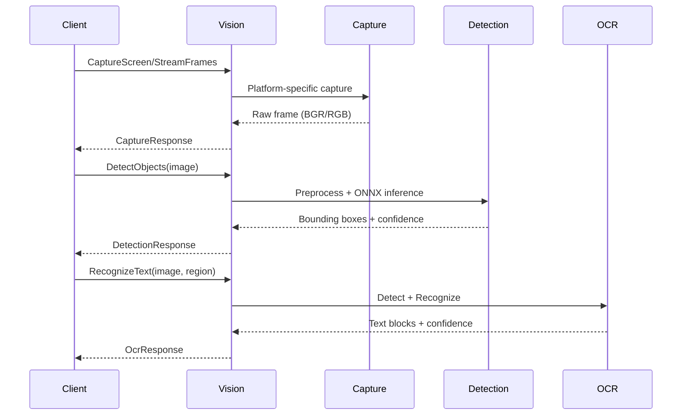
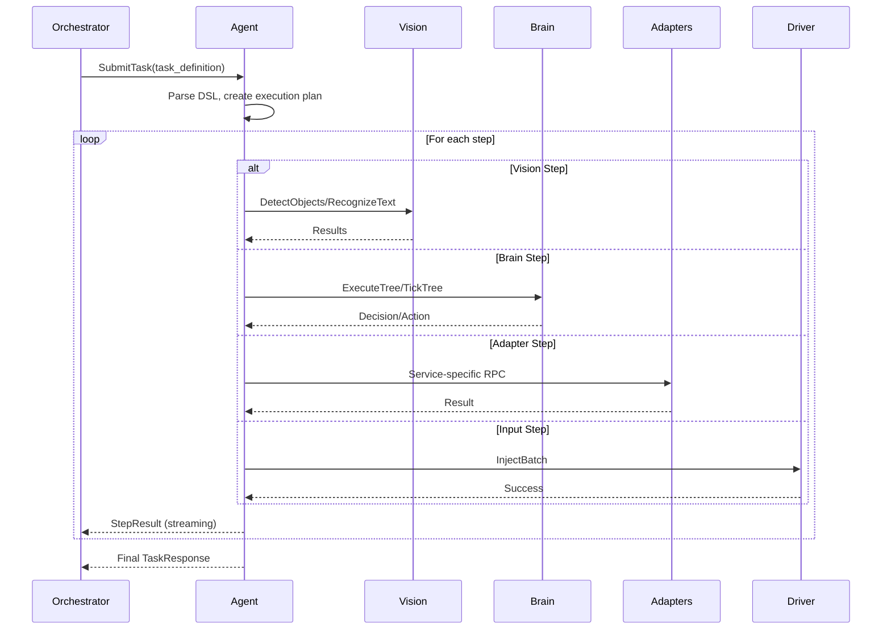
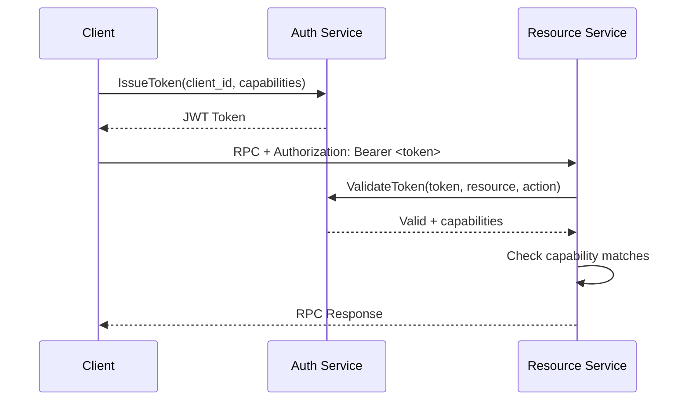

# Human Control System - Architecture Documentation

## System Overview

The Human Control System (HCS) is a production-ready, cross-platform input control system that provides kernel-level input injection, computer vision capabilities, decision-making engines, and application adapters through a unified gRPC API.



## Component Interactions

### 1. Agent Daemon (hcs-agent)
**Port:** 50051 (default)

The central orchestration service that manages input drivers, executes macros, and handles task scheduling.

**Responsibilities:**
- Driver lifecycle management (auto-detection, initialization, shutdown)
- Macro registry and execution with human-like timing variance
- Task queue management with priority and timeout support
- Capability-based JWT authentication
- System health monitoring and metrics exposure

**Key Interactions:**
- Receives input injection requests → routes to appropriate driver
- Executes macros → sequences keyboard/mouse events with variance
- Manages tasks → tracks status, streams progress, handles cancellation
- Issues/validates tokens → enforces capability-based access control

### 2. Vision Service (hcs-vision)
**Port:** 50052 (default)

High-performance computer vision pipeline with screen capture, object detection (YOLOv8), and OCR (PaddleOCR/Tesseract).

**Responsibilities:**
- Cross-platform screen capture (DXGI/X11/CoreGraphics)
- Real-time object detection with ONNX Runtime + TensorRT
- Text recognition with multi-language support
- Model management (loading, reloading, TensorRT optimization)

**Key Interactions:**
- Agent requests screen capture for visual verification
- Brain service requests object detection for decision making
- Orchestrator uses OCR for text-based automation
- Provides health checks and model status

### 3. Brain Service (hcs-brain)
**Port:** 50053 (default)

Decision engine combining Behavior Trees with WASM plugin system for extensible logic.

**Responsibilities:**
- Behavior Tree execution (Sequence, Selector, Parallel, Decorators)
- Blackboard state management
- WASM plugin sandbox (fuel limits, memory limits, hot-reload)
- Tree visualization (DOT/JSON/Mermaid export)

**Key Interactions:**
- Agent delegates complex decisions to behavior trees
- Vision service provides perception data to blackboard
- Adapters execute actions based on tree decisions
- Plugins extend functionality (custom conditions/actions)

### 4. Adapters Service (hcs-adapters)
**Port:** 50054 (default)

Application-specific adapters for Photoshop, Chrome, Games, and Window Management.

**Responsibilities:**
- **Photoshop:** UXP/CEP integration for document/layer manipulation
- **Chrome:** CDP for DOM interaction, network interception, screenshots
- **Game:** Memory reading/writing, pattern scanning, code injection
- **Window:** Cross-platform window enumeration, focus, positioning, capture

**Key Interactions:**
- Brain service triggers adapter actions via behavior trees
- Orchestrator directly invokes adapter operations
- Vision service provides context for adapter operations

### 5. Orchestrator (hcs-orchestrator)
**Interface:** CLI, TUI, gRPC

User-facing orchestration layer with Task DSL, recording/replay, and REPL.

**Responsibilities:**
- Task DSL parsing and execution (YAML/Starlark)
- Input recording with timestamps
- Variable-speed replay with loop support
- Interactive REPL for exploration
- TUI dashboard for monitoring

### 6. Input Drivers

| Driver | Platform | Technology | Latency | Use Case |
|--------|----------|------------|---------|----------|
| Interception | Windows | Kernel driver | < 1ms | Production Windows |
| uinput | Linux | Kernel module | < 1ms | Production Linux |
| HID | Cross-platform | USB Serial/Raw HID | < 1ms | Hardware/Undetectable |
| Synthetic | All | In-memory | N/A | Testing/CI |

### 7. Hardware Firmware
**Target:** Teensy 4.0/4.1 (ARM Cortex-M7 @ 600MHz)

Custom QMK-based firmware with:
- Standard USB HID (Keyboard NKRO, Mouse, Consumer, System)
- Raw HID custom binary protocol
- Acknowledgment protocol with retries
- Heartbeat/keepalive
- Bootloader entry command

## Data Flow

### Input Injection Flow


### Vision Pipeline Flow


### Task Execution Flow


### Authentication Flow


## Deployment Architecture

### Standalone (Development)
```
┌─────────────────────────────────────┐
│         Single Machine              │
├─────────────────────────────────────┤
│  hcs-agent (privileged)             │
│  hcs-vision (GPU)                   │
│  hcs-brain                          │
│  hcs-adapters                       │
│  hcs-orchestrator (CLI/TUI)         │
└─────────────────────────────────────┘
```

### Docker Compose (Production)
```
┌─────────────────────────────────────┐
│         Docker Network              │
├─────────────────────────────────────┤
│  hcs-agent (host net, privileged)   │
│  hcs-vision (nvidia runtime, GPU)   │
│  hcs-brain                          │
│  hcs-orchestrator (profile: cli)    │
│  hcs-dev (dev environment)          │
└─────────────────────────────────────┘
  Volumes: config, data, logs, models
```

### Distributed (Scale)
```
                    ┌─────────────┐
                    │ Load Balancer│
                    └──────┬──────┘
           ┌──────────────┼──────────────┐
           ▼              ▼              ▼
      ┌─────────┐    ┌─────────┐    ┌─────────┐
      │ Agent 1 │    │ Agent 2 │    │ Agent N │
      └────┬────┘    └────┬────┘    └────┬────┘
           │              │              │
           └──────────────┼──────────────┘
                          ▼
                   ┌─────────────┐
                   │   Vision    │  (GPU Cluster)
                   │  (Stateless)│
                   └──────┬──────┘
                          │
                   ┌──────┴──────┐
                   ▼             ▼
              ┌─────────┐   ┌─────────┐
              │ Brain 1 │   │ Brain 2 │
              └────┬────┘   └────┬────┘
                   │             │
                   └──────┬──────┘
                          ▼
                   ┌─────────────┐
                   │  Adapters   │
                   │ (Per-App)   │
                   └─────────────┘
```

## Security Model

### Capability-Based Access Control
```
Token Capabilities:
┌─────────────────────────────────────────────────────────┐
│  Resource: "input"          Actions: [READ, WRITE]     │
│  Resource: "vision"         Actions: [READ, EXECUTE]   │
│  Resource: "brain"          Actions: [EXECUTE]         │
│  Resource: "adapters.ps"    Actions: [EXECUTE]         │
│  Resource: "adapters.chrome" Actions: [READ, EXECUTE]  │
│  Resource: "system"         Actions: [ADMIN]           │
└─────────────────────────────────────────────────────────┘
```

### Transport Security
- **Development:** Plaintext gRPC (localhost)
- **Production:** mTLS with certificate rotation
- **Token:** JWT with RS256, short TTL (15min default), refresh tokens

## Observability

### Metrics (Prometheus)
- **Agent:** `hcs_input_events_total`, `hcs_macro_executions_total`, `hcs_task_duration_seconds`
- **Vision:** `hcs_capture_latency_ms`, `hcs_detection_inference_ms`, `hcs_ocr_inference_ms`
- **Brain:** `hcs_tree_ticks_total`, `hcs_wasm_execution_ms`, `hcs_plugin_load_duration_ms`
- **Adapters:** Per-adapter operation latency and error rates

### Health Checks
All services expose `/health` gRPC endpoint returning:
- `SERVING` / `NOT_SERVING` / `STARTING` / `STOPPING`
- Component-level health (driver, models, plugins, connections)
- Uptime and version information

### Logging
Structured JSON logging with correlation IDs:
```json
{
  "timestamp": "2026-10-03T12:00:00Z",
  "level": "INFO",
  "service": "hcs-agent",
  "trace_id": "abc123",
  "span_id": "def456",
  "message": "Task executed",
  "task_id": "task-789",
  "duration_ms": 45
}
```

## Performance Targets

| Metric | Target | Measurement |
|--------|--------|-------------|
| Input injection latency | < 1ms | Driver level |
| Screen capture latency | < 5ms | End-to-end |
| YOLOv8 inference (GPU) | < 30ms | Batch=1, 640x640 |
| OCR inference (GPU) | < 50ms | Single region |
| Behavior tree tick | < 1ms | 100 nodes |
| WASM plugin call | < 5ms | Simple function |
| gRPC round-trip (local) | < 2ms | Unary call |

## Technology Stack

| Layer | Technology |
|-------|------------|
| Core Runtime | Rust 1.75+ (agent, brain, adapters, orchestrator, driver) |
| Vision | Python 3.11+ (ONNX Runtime, PaddleOCR, OpenCV) |
| gRPC | Tonic (Rust), grpcio (Python) |
| Protobuf | prost (Rust), protobuf (Python) |
| Async | Tokio (Rust), asyncio (Python) |
| WASM | Wasmtime 25+ (Component Model) |
| Config | TOML + Environment variables |
| Logging | tracing (Rust), structlog (Python) |
| Metrics | Prometheus client libraries |
| Container | Docker, Docker Compose |
| CI/CD | GitHub Actions |
| Hardware | Teensy 4.0/4.1, ARM GCC, CMake |

## Directory Structure

```
human-control-system/
├── agent/              # Agent daemon (Rust)
│   ├── proto/          # Protobuf definitions
│   └── src/            # Services, auth, driver manager
├── brain/              # Decision engine (Rust)
│   ├── proto/          # Protobuf definitions
│   └── src/            # BT engine, WASM runtime
├── adapters/           # App adapters (Rust)
│   ├── proto/          # Protobuf definitions
│   └── src/            # Photoshop, Chrome, Game, Window
├── orchestrator/       # CLI/TUI/DSL (Rust)
│   ├── proto/          # Protobuf definitions
│   └── src/            # DSL, REPL, Recorder, TUI
├── driver/             # Input drivers (Rust)
│   └── src/            # Interception, uinput, HID, Synthetic
├── vision/             # Computer vision (Python)
│   ├── src/            # Capture, Detection, OCR, Service
│   ├── proto/          # Protobuf definitions
│   └── config/         # TOML configuration
├── hardware/           # Teensy firmware (C)
│   ├── firmware/       # Source code
│   └── scripts/        # Build/flash scripts
├── docker/             # Dockerfiles, compose
├── config/             # Configuration templates
├── docs/               # This documentation
└── tests/              # Integration tests
```

## Communication Protocols

### gRPC Services
All services use Protocol Buffers v3 with gRPC:
- **Unary RPCs:** Request/Response (most operations)
- **Server Streaming:** Frame capture, task progress, metrics
- **Client Streaming:** High-frequency input injection
- **Bidirectional Streaming:** REPL, interactive sessions

### Service Endpoints
| Service | Port | Protocol |
|---------|------|----------|
| Agent | 50051 | gRPC |
| Vision | 50052 | gRPC |
| Brain | 50053 | gRPC |
| Adapters | 50054 | gRPC |
| Orchestrator | 50055 | gRPC |

### Hardware Protocol
Custom binary protocol over USB Raw HID (Report ID 5):
```
| Magic(4) | Ver(1) | Cmd(1) | Seq(2) | Len(2) | Payload(N) |
```
With acknowledgment, heartbeat, and retry logic.

## Extension Points

1. **Custom Input Drivers:** Implement `InputDriver` trait
2. **Vision Models:** Drop ONNX models in `models/`, update config
3. **Brain Plugins:** Compile to WASM Component Model, place in `wasm-plugins/`
4. **Adapters:** Implement adapter trait, register in adapter service
5. **DSL Functions:** Add to Starlark stdlib in orchestrator
6. **Macros:** Register via gRPC or define in Task DSL